# Entity Relationship Diagram (Conceptual)

> See `Database/Tables.md` for full column-level schema and
> `Database/Relationships.md` for cardinality detail. This file gives the
> whole-system shape.

```mermaid
erDiagram
    USERS ||--o| STUDENTS : "is-a (role=STUDENT)"
    USERS ||--o| UNIVERSITY_OFFICERS : "is-a"
    USERS ||--o| LOAN_PROVIDER_OFFICERS : "is-a"
    USERS ||--o| CONSULTANTS : "is-a"

    UNIVERSITIES ||--o{ UNIVERSITY_OFFICERS : employs
    UNIVERSITIES ||--o{ UNIVERSITY_PROGRAMS : offers
    UNIVERSITIES ||--o{ UNIVERSITY_OFFER_TEMPLATES : defines
    UNIVERSITIES ||--|| SUBSCRIPTIONS : has

    LOAN_PROVIDERS ||--o{ LOAN_PROVIDER_OFFICERS : employs
    LOAN_PROVIDERS ||--o{ LOAN_PRODUCTS : offers
    LOAN_PROVIDERS ||--o{ LOAN_OFFER_TEMPLATES : defines
    LOAN_PROVIDERS ||--|| SUBSCRIPTIONS : has

    CONSULTANCIES ||--o{ CONSULTANTS : employs
    CONSULTANCIES ||--o{ CONSULTING_PACKAGES : offers
    CONSULTANCIES ||--|| SUBSCRIPTIONS : has

    STUDENTS ||--o{ STUDENT_ACADEMIC_RECORDS : has
    STUDENTS ||--o{ STUDENT_TEST_SCORES : has
    STUDENTS ||--|| STUDENT_PREFERENCES : has
    STUDENTS ||--o{ STUDENT_DOCUMENTS : uploads
    STUDENTS ||--|| STUDENT_VISIBILITY_SETTINGS : has

    STUDENTS ||--o{ INVITATIONS : receives
    UNIVERSITY_OFFICERS ||--o{ INVITATIONS : sends
    LOAN_PROVIDER_OFFICERS ||--o{ INVITATIONS : sends
    CONSULTANTS ||--o{ INVITATIONS : sends

    INVITATIONS ||--|| OFFERS : carries
    INVITATIONS ||--o{ INVITATION_STATUS_HISTORY : logs
    INVITATIONS ||--o| NEGOTIATIONS : may_have
    NEGOTIATIONS ||--o{ NEGOTIATION_MESSAGES : contains

    STUDENTS ||--o{ MATCH_SCORES : scored_against
    MATCH_SCORES ||--o{ MATCH_SCORE_FACTORS : explained_by

    CONSULTANTS ||--o{ CONSULTANT_CLIENT_RELATIONSHIPS : engages
    STUDENTS ||--o{ CONSULTANT_CLIENT_RELATIONSHIPS : engaged_by

    USERS ||--o{ NOTIFICATIONS : receives
    USERS ||--|| USER_SETTINGS : has

    SUBSCRIPTIONS ||--o{ QUOTA_USAGE : tracks
    SUBSCRIPTIONS ||--o{ INVOICES : generates
```

## Reading notes

- `USERS` is the single authentication identity table; role-specific tables
  (`STUDENTS`, `UNIVERSITY_OFFICERS`, `LOAN_PROVIDER_OFFICERS`,
  `CONSULTANTS`) extend it 1:1 based on `users.role`.
- `INVITATIONS.sender_org_type` / `sender_org_id` polymorphically points at
  `UNIVERSITIES`, `LOAN_PROVIDERS`, or `CONSULTANCIES` (see
  `Database/Naming_Conventions.md` §3) — not drawn as three separate
  relationships above for readability, but implemented that way.
- `OFFERS.terms` is the type-varying JSON payload described in
  `Naming_Conventions.md` §5 — its shape depends on the invitation's
  institution type.
- `CONSULTANT_CLIENT_RELATIONSHIPS` is the table that grants the one
  cross-module read-access exception described in
  `Modules/05_Study_Abroad_Consultant_Management.md`.
